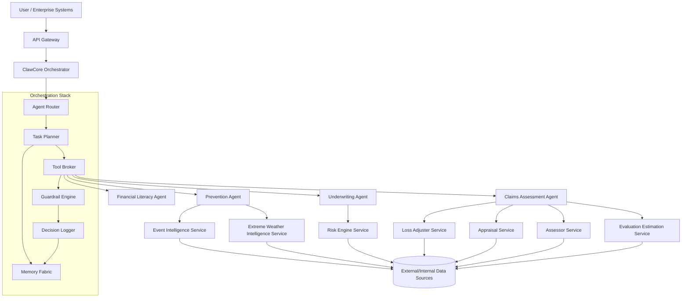
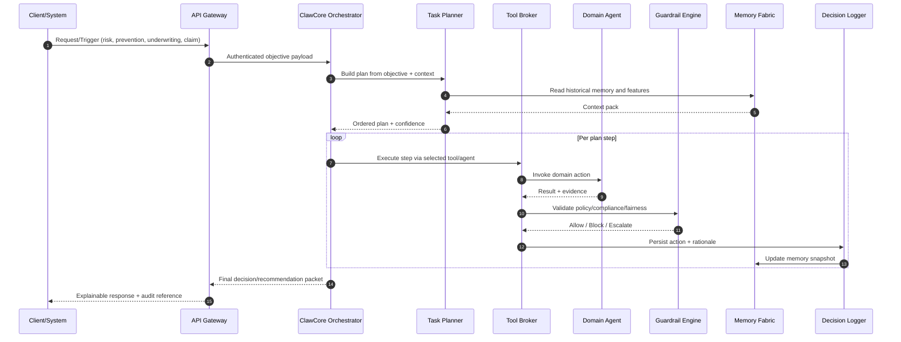
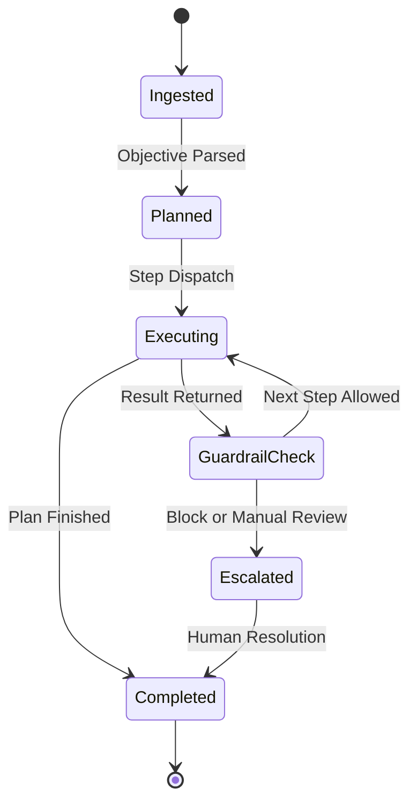

# InsurClaw Architecture & Orchestration Specification

## 1) Architectural style

InsurClaw uses a **multi-agent, event-driven orchestration architecture** inspired by OpenClaw's autonomous control loop:

- Goal intake
- Planning
- Tool invocation
- Memory update
- Policy validation
- Action/response

The clone-mimic runtime is called **ClawCore Orchestrator** and is composed of:

- Agent Router
- Task Planner
- Tool Broker
- State & Memory Fabric
- Guardrail Engine
- Decision Logger

---

## 2) Layered architecture

---

## 3) Orchestration runtime flow

---

## 4) Domain orchestration topologies

## 4.1 Financial literacy topology

- Trigger: onboarding, renewal, risk change.
- Pipeline: profile segmentation -> knowledge-gap inference -> personalized module generation -> behavioral nudges.
- Feedback loop: behavior signals update user literacy model.

## 4.2 Prevention-as-a-Service topology

- Trigger: event feed, weather alert, geospatial anomaly.
- Pipeline: exposure match -> risk amplification scoring -> prevention playbook selection -> customer notifications and underwriter alerts.
- Escalation: severe risk amplification triggers underwriting re-evaluation.

## 4.3 Underwriting topology

- Trigger: new quote, renewal, endorsement.
- Pipeline: feature extraction -> risk scoring -> terms optimization -> confidence and bias checks -> recommendation.
- Escalation: low confidence / fairness warning -> manual underwriting queue.

## 4.4 Claim assessment topology

- Trigger: FNOL (first notice of loss) or claim update.
- Pipeline: evidence ingestion -> coverage validation -> causality assessment -> appraisal/estimation -> settlement options.
- Escalation: anomaly/fraud indicators -> SIU/legal/manual review.

---

## 5) State model

---

## 6) Reliability and control patterns

- Idempotency keys per orchestration run.
- Retry policy with exponential backoff for transient tool failures.
- Dead-letter queue for irrecoverable step failures.
- Circuit breakers for unstable upstream data providers.
- Policy kill-switch for unsafe autonomous actions.
- Deterministic replay mode for audits.

---

## 7) Security and governance model

- Service-to-service mTLS and short-lived tokens.
- Tool capability scoping (least privilege per agent).
- PII minimization and field-level encryption.
- Explainability ledger retained as tamper-evident log.
- Region-aware policy packs for regulatory adaptation.

