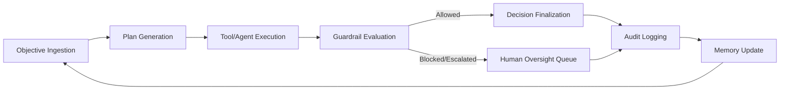

# OpenClaw Clone-Mimic Blueprint for InsurClaw

## 1) Intent

This blueprint translates OpenClaw-style autonomous agent patterns into an insurance-native architecture called **InsurClaw ClawCore**.

The objective is functional parity with OpenClaw orchestration ideas while enabling:

- Domain-specific insurance reasoning.
- Swappable model/tool backends.
- Enterprise governance and audit controls.

---

## 2) OpenClaw pattern to InsurClaw mapping

| OpenClaw-style pattern | InsurClaw clone-mimic equivalent | Insurance-specific adaptation |
|---|---|---|
| Goal-driven agent loop | Objective-driven orchestration run | Uses policyholder, policy, claim, and exposure context |
| Planner | Task Planner | Supports underwriting/claims/prevention-specific task templates |
| Tool execution | Tool Broker | Connectors for weather, geospatial, actuarial, claims evidence |
| Memory/context | Memory Fabric | Entity-centric memory for policy lifecycle + claim history |
| Safety/policy layer | Guardrail Engine | Compliance packs, fairness checks, claims governance rules |
| Action trace/logging | Decision Logger | Audit-grade explainability and regulator-ready reports |

---

## 3) Clone-mimic control loop

---

## 4) Required implementation modules

1. **clawcore-orchestrator**
   - Runtime coordinator and step executor.
2. **insurance-domain-agent-pack**
   - Literacy, prevention, underwriting, and claims agents.
3. **connector-pack**
   - Weather, event, pricing benchmarks, policy admin, claims intake.
4. **governance-pack**
   - Rulesets for compliance, fairness, legal holds.
5. **observability-pack**
   - Traces, metrics, event lineage, and replay interface.

---

## 5) Decision policy tiers

- **Tier 0 (informational)**: literacy and low-risk prevention nudges.
- **Tier 1 (assisted decisions)**: underwriting suggestions with human review option.
- **Tier 2 (restricted autonomy)**: claim pre-assessment and settlement range with guardrails.
- **Tier 3 (manual authority)**: legal/fraud/compliance-sensitive decisions.

---

## 6) MVP release envelope

### Included
- Financial literacy autonomous workflows.
- Prevention event + extreme weather alerting.
- Underwriting risk engine recommendations.
- Claims assessment chain (loss adjuster, appraisal, assessor, evaluation).

### Deferred
- Full self-serve model marketplace.
- Real-time drone/computer-vision adjuster automation.
- Cross-carrier federated risk intelligence.

---

## 7) Acceptance criteria

- Every autonomous output includes explainability notes.
- Every workflow run has end-to-end correlation ID and audit artifact.
- Guardrail violations always create escalation tickets.
- Domain modules can be deployed and scaled independently.

